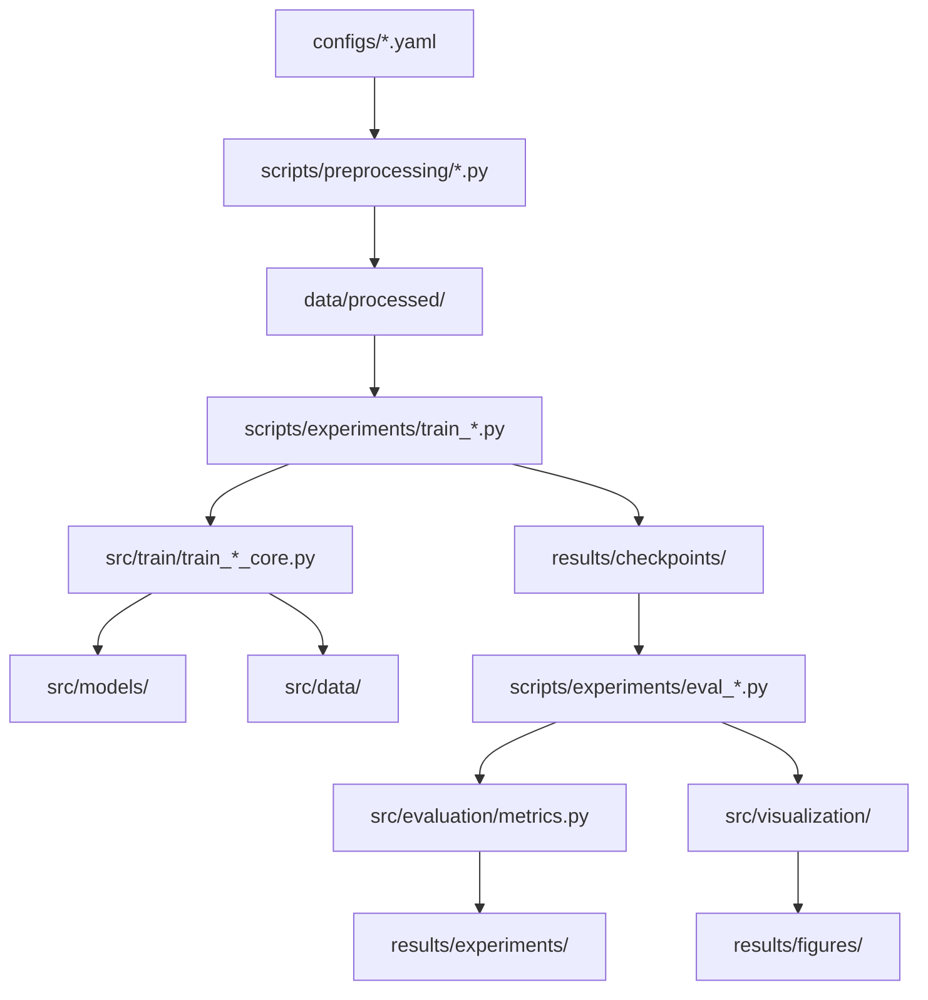

# 虚拟细胞算子模型项目 - 完整实验分析设计报告

生成时间：2025-11-20
任务：为虚拟细胞算子模型项目设计完整的实验分析代码

---

## 第一部分：实验设计核心考虑因素

### 1.1 实验目标层次

#### 科学验证目标
1. **方法正确性验证**
   - 算子模型能否准确预测扰动响应
   - 低秩分解是否保留关键信息
   - E-distance是否有效衡量分布差异

2. **生物学洞察目标**
   - mLOY在肾脏和脑中的跨组织效应
   - 响应基B_k的生物学可解释性
   - 反事实模拟的合理性

3. **工程性能目标**
   - 训练效率和收敛速度
   - 推理速度（虚拟细胞生成）
   - 内存占用和可扩展性

#### 对比基准目标
1. **简单基线**
   - 线性回归（每基因独立）：证明非线性必要性
   - 最近邻匹配：证明生成式模型优势

2. **深度学习基线**
   - scGen：证明算子结构的优势
   - CPA（Compositional Perturbation Autoencoder）：证明低秩分解的泛化能力

3. **上界参考**
   - Oracle（真实数据）：评估预测上限

### 1.2 数据需求分析

#### scPerturb数据
**必需字段**：
```python
adata.obs["dataset_id"]      # 数据集标识
adata.obs["tissue"]          # 组织类型
adata.obs["cell_type"]       # 细胞类型
adata.obs["perturbation"]    # 扰动类型（drug、KO等）
adata.obs["timepoint"]       # 时间点 "t0" 或 "t1"
adata.obs["batch"]           # 批次（用于批次效应校正）
adata.X                       # (n_cells, n_genes) 表达矩阵
```

**可选字段**：
```python
adata.obs["donor_id"]        # 个体ID（用于个体效应建模）
adata.obs["dose"]            # 药物剂量（用于剂量响应建模）
```

**数据规模估计**：
- 细胞数：50,000 - 200,000
- 基因数（筛选后）：2,000 - 3,000
- 条件数（θ）：100 - 500
- 每条件细胞数：500 - 5,000

#### mLOY数据
**必需字段**：
```python
adata.obs["tissue"]          # "kidney" 或 "brain"
adata.obs["cell_type"]       # 细胞类型
adata.obs["mLOY_status"]     # "XY" 或 "LOY"
adata.obs["mLOY_prob"]       # cell-level LOY概率 [0,1]
adata.obs["donor_id"]        # 个体ID
adata.obs["mLOY_load"]       # donor-level LOY负荷 [0,1]
adata.obs["age"]             # 年龄
adata.obs["disease_state"]   # 如"CKD_stage3"、"AD"等
```

**数据来源**：
- 肾脏：Genome Biology 2024，GEO: GSE232222
- 脑微胶质：Genome Research mLOY研究 + AD atlas

### 1.3 计算资源需求

#### 硬件配置
**最低配置**：
- GPU: NVIDIA RTX 3090 (24GB)
- RAM: 64GB
- 存储: 500GB SSD

**推荐配置**：
- GPU: NVIDIA A100 (40GB) × 2
- RAM: 128GB
- 存储: 1TB NVMe SSD

#### 运行时间估计
**VAE训练**（scPerturb，100 epochs）：
- 单GPU（RTX 3090）：4-6小时
- 双GPU（A100）：2-3小时

**算子训练**（100 epochs）：
- 单GPU：6-8小时
- 双GPU：3-4小时

**全流程实验**（包括评估和可视化）：
- 单次实验：12-15小时
- 完整实验矩阵（3个baselines × 5个设置）：3-4天

---

## 第二部分：推荐的实验组织结构

### 2.1 目录结构扩展

```
virtual-cell-operator-mLOY/
├── src/
│   ├── evaluation/              # 【新增】评估模块
│   │   ├── __init__.py
│   │   ├── metrics.py           # 评估指标集合
│   │   ├── perturbation_eval.py # 扰动预测评估
│   │   └── counterfactual_eval.py # 反事实模拟评估
│   │
│   ├── visualization/           # 【新增】可视化模块
│   │   ├── __init__.py
│   │   ├── latent_space.py      # 潜空间可视化
│   │   ├── trajectories.py      # 轨迹可视化
│   │   ├── response_profiles.py # 响应轮廓热图
│   │   └── gene_expression.py   # 基因表达对比
│   │
│   └── utils/
│       └── cond_encoder.py      # 【新增】条件编码器
│
├── scripts/
│   ├── preprocessing/           # 【新增】预处理脚本
│   │   ├── preprocess_scperturb.py
│   │   ├── preprocess_mloy_kidney.py
│   │   ├── preprocess_mloy_brain.py
│   │   └── build_condition_metadata.py
│   │
│   ├── experiments/             # 【新增】实验脚本
│   │   ├── train_scperturb_baseline.py
│   │   ├── eval_perturbation_prediction.py
│   │   ├── analyze_response_axes.py
│   │   ├── run_counterfactual_mloy.py
│   │   └── cross_tissue_comparison.py
│   │
│   └── baselines/               # 【新增】基线方法
│       ├── linear_regression_baseline.py
│       ├── scgen_baseline.py
│       └── nearest_neighbor_baseline.py
│
├── configs/                     # 【新增】配置文件
│   ├── scperturb_vae.yaml       # VAE训练配置
│   ├── scperturb_operator.yaml  # 算子训练配置
│   ├── mloy_kidney.yaml
│   └── mloy_brain.yaml
│
├── notebooks/                   # 【新增】分析notebook
│   ├── 00_data_exploration.ipynb
│   ├── 01_model_diagnostics.ipynb
│   ├── 02_response_axes_analysis.ipynb
│   ├── 03_mloy_counterfactual.ipynb
│   └── 04_cross_tissue_comparison.ipynb
│
└── results/
    ├── experiments/             # 【新增】实验结果
    │   ├── scperturb_baseline/
    │   ├── mloy_kidney/
    │   └── mloy_brain/
    │
    └── figures/                 # 【新增】论文图表
        ├── Fig1_overview/
        ├── Fig2_scperturb_benchmark/
        ├── Fig3_response_axes/
        └── Fig4_mloy_cross_tissue/
```

### 2.2 核心模块依赖关系



---

## 第三部分：关键技术挑战和解决方案

### 3.1 条件编码器设计

#### 挑战
- 条件字段多样（扰动、组织、mLOY、批次等）
- 新条件可能出现（零样本泛化）
- 维度权衡（过高→过拟合，过低→表达不足）

#### 推荐方案

```python
# src/utils/cond_encoder.py（伪代码）

class ConditionEncoder:
    """条件向量编码器
    
    输入: obs_dict（包含perturbation, tissue, mLOY_load, batch等）
    输出: cond_vec（固定维度的向量）
    
    实现策略:
        1. 分类变量：one-hot或learned embedding
        2. 连续变量（mLOY_load）：直接拼接
        3. 整合：拼接后线性投影到cond_dim
    """
    
    def __init__(self, 
                 perturbation_vocab: List[str],
                 tissue_vocab: List[str],
                 cond_dim: int = 64,
                 use_learned_embedding: bool = True):
        self.perturbation_vocab = perturbation_vocab
        self.tissue_vocab = tissue_vocab
        self.cond_dim = cond_dim
        
        if use_learned_embedding:
            # Learned embedding（更好的泛化）
            self.pert_embedding = nn.Embedding(len(perturbation_vocab), 16)
            self.tissue_embedding = nn.Embedding(len(tissue_vocab), 8)
        else:
            # One-hot（更可解释）
            pass
        
        # 拼接后投影
        input_dim = 16 + 8 + 1  # pert_emb + tissue_emb + mLOY_load
        self.linear = nn.Linear(input_dim, cond_dim)
    
    def encode_obs_row(self, obs_dict: Dict) -> torch.Tensor:
        """编码单个obs行"""
        pert_idx = self.perturbation_vocab.index(obs_dict["perturbation"])
        tissue_idx = self.tissue_vocab.index(obs_dict["tissue"])
        mLOY_load = obs_dict.get("mLOY_load", 0.0)
        
        pert_vec = self.pert_embedding(torch.tensor(pert_idx))  # (16,)
        tissue_vec = self.tissue_embedding(torch.tensor(tissue_idx))  # (8,)
        mLOY_vec = torch.tensor([mLOY_load])  # (1,)
        
        concat = torch.cat([pert_vec, tissue_vec, mLOY_vec])  # (25,)
        cond_vec = self.linear(concat)  # (64,)
        
        return cond_vec
```

**权衡分析**：
| 方案 | 优势 | 劣势 | 推荐场景 |
|------|------|------|----------|
| One-hot | 可解释性强，零样本友好 | 维度高，稀疏 | 扰动类型<100 |
| Learned embedding | 维度低，泛化好 | 需预训练，黑盒 | 扰动类型>100 |
| Hybrid | 平衡两者 | 实现复杂 | 推荐方案 |

**推荐**：Hybrid方案
- 重要变量（tissue, perturbation）: Learned embedding
- 稀有变量（batch）: One-hot
- 连续变量（mLOY_load, age）: 直接拼接

### 3.2 评估指标设计

#### 指标体系

**1. 重建质量指标**（评估VAE）
```python
def reconstruction_metrics(x_true, x_pred):
    """
    返回:
        - mse: 均方误差
        - pearson: Pearson相关系数（gene-wise平均）
        - spearman: Spearman相关系数
        - r2_score: R²分数
    """
```

**2. 分布级别指标**（评估算子）
```python
def distribution_metrics(z_true, z_pred):
    """
    返回:
        - energy_distance: E-distance（主要指标）
        - wasserstein_distance: 1-Wasserstein距离（可选）
        - kl_divergence: KL散度（高斯近似）
        - mmd: Maximum Mean Discrepancy（可选）
    """
```

**3. 差异基因预测指标**（生物学验证）
```python
def de_gene_prediction_metrics(x0, x1_true, x1_pred, top_k=200):
    """
    评估预测是否捕获真实的差异基因
    
    流程:
        1. 计算真实DE: log2FC(x1_true / x0)
        2. 计算预测DE: log2FC(x1_pred / x0)
        3. 排序基因：取top_k
        4. 计算AUROC、AUPRC
        
    返回:
        - auroc: 二分类AUROC（top_k vs 其他）
        - auprc: 二分类AUPRC
        - jaccard: top_k基因集合的Jaccard相似度
        - rank_correlation: Spearman秩相关
    """
```

**4. 通路富集一致性**（高层生物学验证）
```python
def pathway_enrichment_consistency(x1_true, x1_pred, pathway_db="KEGG"):
    """
    比较真实和预测细胞的通路富集结果
    
    流程:
        1. 对真实细胞做通路富集（如GSEA）
        2. 对预测细胞做同样分析
        3. 计算通路排名的相关性
        
    返回:
        - pathway_rank_corr: 通路NES（normalized enrichment score）排名相关系数
        - top_pathway_jaccard: top通路的Jaccard相似度
    """
```

**5. 算子质量指标**（模型内在评估）
```python
def operator_quality_metrics(operator_model, tissue_idx, cond_vec):
    """
    返回:
        - spectral_norm: 谱范数统计（mean, max, min）
        - low_rank_error: 低秩近似误差（如果有局部算子作为ground truth）
        - response_sparsity: 响应系数α_k的稀疏度（L0 norm）
        - basis_orthogonality: 响应基B_k的正交性（可选）
    """
```

#### 指标优先级

**核心指标**（必须报告）：
1. Energy distance（分布匹配的主要指标）
2. DE gene AUROC（生物学相关性）
3. Reconstruction Pearson correlation（重建质量）

**辅助指标**（用于深入分析）：
1. Pathway enrichment consistency
2. Spectral norm statistics
3. Response sparsity

**调试指标**（训练过程监控）：
1. Training/validation loss curves
2. Gradient norms
3. NaN/Inf检测频率

### 3.3 大规模数据处理

#### 内存优化策略

**问题**：E-distance计算的O(n²m)复杂度
```python
# 示例：n=5000, m=5000, d=32
# 距离矩阵: (5000, 5000) × 4 bytes = 100MB
# 如果batch=10，总内存: 1GB（可接受）
# 如果batch=100，总内存: 10GB（可能OOM）
```

**解决方案1**：分块计算
```python
# 已实现：src/utils/edistance.py中的energy_distance_batched
# 使用方式：
ed2 = energy_distance_batched(z_pred, z_true, batch_size=1000)
```

**解决方案2**：梯度累积
```python
# 在train_operator_core.py中添加：
accumulation_steps = 4  # 每4个mini-batch更新一次
for i, batch in enumerate(dataloader):
    loss = compute_loss(batch) / accumulation_steps
    loss.backward()
    
    if (i + 1) % accumulation_steps == 0:
        optimizer.step()
        optimizer.zero_grad()
```

**解决方案3**：混合精度训练
```python
from torch.cuda.amp import autocast, GradScaler

scaler = GradScaler()
for batch in dataloader:
    with autocast():  # 自动使用FP16
        loss = compute_loss(batch)
    
    scaler.scale(loss).backward()
    scaler.step(optimizer)
    scaler.update()
```

#### 数据加载优化

**问题**：AnnData加载慢、内存占用大

**解决方案**：
1. **预处理阶段**：保存为密集格式
```python
# scripts/preprocessing/preprocess_scperturb.py
adata = sc.read_h5ad("raw.h5ad")
# 筛选高变基因
adata = adata[:, adata.var["highly_variable"]]
# 转为密集矩阵（如果稀疏度<50%）
if adata.X.nnz / adata.X.size < 0.5:
    adata.X = adata.X.toarray()
adata.write_h5ad("processed.h5ad")
```

2. **训练阶段**：使用pin_memory加速GPU传输
```python
dataloader = DataLoader(
    dataset,
    batch_size=512,
    num_workers=4,
    pin_memory=True,  # 加速CPU→GPU传输
    persistent_workers=True  # 保持worker进程活跃
)
```

### 3.4 零样本泛化测试

#### 实验设计

**目标**：测试模型对未见扰动组合的泛化能力

**协议**：
```python
# 训练集：只有单扰动
train_perturbations = ["drug_A", "drug_B", "KO_gene_C"]

# 测试集：扰动组合（如果数据中有）
test_perturbations = ["drug_A+drug_B", "drug_A+KO_gene_C"]

# 评估：
# 1. 用训练好的模型预测组合效应
# 2. 对比真实组合扰动的细胞
# 3. 报告E-distance和DE gene AUROC
```

**挑战**：
- scPerturb中组合扰动数据稀少
- 可能需要设计"虚拟组合"（连续应用两个算子）

**替代方案**：
```python
# 虚拟组合实验
def virtual_combination_test(vae, operator, x0, cond_A, cond_B):
    """
    测试算子组合：K_B(K_A(x0)) vs 真实 x_AB
    """
    z0 = encode_cells(vae, x0)
    z_A = apply_operator(operator, z0, cond_vec=cond_A)
    z_AB_pred = apply_operator(operator, z_A, cond_vec=cond_B)
    x_AB_pred = decode_cells(vae, z_AB_pred)
    
    # 对比 x_AB_pred 与真实 x_AB（如果有）
    ed2 = energy_distance(z_AB_pred, z_AB_true)
    return ed2
```

---

## 第四部分：完整实验流程设计

### 4.1 Phase I: scPerturb基准实验

#### 目标
1. 验证算子模型在标准scPerturb任务上的性能
2. 与现有方法（scGen、CPA）对比
3. 建立评估pipeline

#### 数据准备
```bash
# 1. 下载scPerturb数据
python scripts/preprocessing/download_scperturb.py \
    --datasets norman2019,replogle2022 \
    --output data/raw/scperturb/

# 2. 预处理
python scripts/preprocessing/preprocess_scperturb.py \
    --input data/raw/scperturb/ \
    --output data/processed/scperturb/ \
    --min_cells 100 \
    --min_genes 200 \
    --n_top_genes 2000 \
    --test_split 0.15
```

预处理输出：
```
data/processed/scperturb/
├── scperturb_merged_train.h5ad
├── scperturb_merged_val.h5ad
├── scperturb_merged_test.h5ad
├── tissue2idx.json
├── perturbation2idx.json
└── condition_metadata.csv
```

#### 训练VAE
```bash
python scripts/experiments/train_scperturb_baseline.py \
    --phase vae \
    --config configs/scperturb_vae.yaml \
    --data data/processed/scperturb/scperturb_merged_train.h5ad \
    --output results/checkpoints/scperturb_vae/
```

训练配置（configs/scperturb_vae.yaml）：
```yaml
model:
  n_genes: 2000
  latent_dim: 32
  n_tissues: 1  # scPerturb通常是单组织（blood）
  hidden_dim: 512

training:
  lr_embed: 0.001
  batch_size: 512
  n_epochs_embed: 100
  gradient_clip: 1.0
  beta_kl: 1.0
  warmup_epochs: 10

data:
  data_path: data/processed/scperturb/scperturb_merged_train.h5ad
  min_cells: 100
  min_genes: 200
  n_top_genes: 2000

experiment:
  seed: 42
  device: cuda
  num_workers: 4
  save_checkpoints: true
  checkpoint_freq: 10
```

#### 训练算子
```bash
python scripts/experiments/train_scperturb_baseline.py \
    --phase operator \
    --config configs/scperturb_operator.yaml \
    --data data/processed/scperturb/scperturb_merged_train.h5ad \
    --vae_checkpoint results/checkpoints/scperturb_vae/best_model.pt \
    --output results/checkpoints/scperturb_operator/
```

训练配置（configs/scperturb_operator.yaml）：
```yaml
model:
  latent_dim: 32
  n_tissues: 1
  n_response_bases: 5  # K=5
  cond_dim: 64
  max_spectral_norm: 1.05

training:
  lr_operator: 0.001
  batch_size: 256  # 算子训练batch可以小一些
  n_epochs_operator: 100
  lambda_e: 1.0
  lambda_stab: 0.001
  gradient_clip: 1.0

experiment:
  seed: 42
  freeze_vae: true  # 冻结VAE参数
```

#### 评估
```bash
python scripts/experiments/eval_perturbation_prediction.py \
    --config configs/scperturb_operator.yaml \
    --data data/processed/scperturb/scperturb_merged_test.h5ad \
    --vae_checkpoint results/checkpoints/scperturb_vae/best_model.pt \
    --operator_checkpoint results/checkpoints/scperturb_operator/best_operator.pt \
    --output results/experiments/scperturb_baseline/
```

评估输出：
```
results/experiments/scperturb_baseline/
├── metrics.json                    # 汇总指标
├── per_condition_metrics.csv       # 每个条件的详细指标
├── figures/
│   ├── latent_space_umap.png       # 潜空间UMAP
│   ├── reconstruction_scatter.png  # 重建质量散点图
│   ├── de_gene_auroc_barplot.png   # DE基因AUROC
│   └── training_curves.png         # 训练曲线
└── predictions/
    ├── z_pred.npy                  # 预测的潜变量
    └── x_pred.npy                  # 预测的基因表达
```

metrics.json示例：
```json
{
    "overall": {
        "energy_distance_mean": 0.234,
        "energy_distance_std": 0.056,
        "de_gene_auroc_mean": 0.812,
        "reconstruction_pearson_mean": 0.745
    },
    "per_perturbation": {
        "drug_A": {
            "energy_distance": 0.198,
            "de_gene_auroc": 0.834,
            "n_cells_test": 1234
        }
    }
}
```

#### 基线对比
```bash
# 运行线性回归基线
python scripts/baselines/linear_regression_baseline.py \
    --data data/processed/scperturb/ \
    --output results/baselines/linear_regression/

# 运行scGen基线（如果实现）
python scripts/baselines/scgen_baseline.py \
    --data data/processed/scperturb/ \
    --output results/baselines/scgen/

# 汇总对比
python scripts/experiments/compare_baselines.py \
    --methods operator,linear,scgen \
    --results_dirs results/experiments/scperturb_baseline/,results/baselines/linear_regression/,results/baselines/scgen/ \
    --output results/comparisons/scperturb_benchmark.pdf
```

### 4.2 Phase II: 响应基分析

#### 目标
1. 提取响应基B_k的生物学含义
2. 分析α_k(θ)的激活模式
3. 可视化响应轮廓

#### 分析脚本
```bash
python scripts/experiments/analyze_response_axes.py \
    --operator_checkpoint results/checkpoints/scperturb_operator/best_operator.pt \
    --vae_checkpoint results/checkpoints/scperturb_vae/best_model.pt \
    --data data/processed/scperturb/scperturb_merged_train.h5ad \
    --output results/experiments/response_axes_analysis/
```

分析内容：
1. **响应基可视化**
   - 对每个B_k，计算其对基因表达的影响方向
   - 使用解码器的Jacobian：∂x/∂z × B_k
   - 提取top基因，做通路富集

2. **激活模式分析**
   - 对所有训练条件，提取α_k(θ)
   - 聚类分析：哪些扰动激活相似的响应基
   - 热图可视化：条件×响应基矩阵

3. **基间关系**
   - 计算B_k之间的余弦相似度
   - 检查是否正交（理想情况）
   - 分析冗余性

输出示例：
```
results/experiments/response_axes_analysis/
├── response_bases_genes.csv        # 每个基对应的top基因
├── response_bases_pathways.csv     # 通路富集结果
├── activation_heatmap.png          # α_k(θ)热图
├── basis_similarity_matrix.png     # B_k相似度矩阵
└── trajectory_visualization.png    # 在响应基空间中的轨迹
```

### 4.3 Phase III: mLOY反事实模拟

#### 目标
1. 训练包含mLOY数据的算子模型
2. 执行"mLOY纠正"反事实实验
3. 分析跨组织（肾脏vs脑）的mLOY效应

#### 数据准备
```bash
# 预处理肾脏数据
python scripts/preprocessing/preprocess_mloy_kidney.py \
    --input data/raw/mloy/kidney_GSE232222.h5ad \
    --output data/processed/mloy/kidney_processed.h5ad \
    --annotate_mLOY true

# 预处理脑数据
python scripts/preprocessing/preprocess_mloy_brain.py \
    --input data/raw/mloy/brain_microglia.h5ad \
    --output data/processed/mloy/brain_processed.h5ad \
    --annotate_mLOY true

# 合并scPerturb + mLOY数据
python scripts/preprocessing/merge_datasets.py \
    --scperturb data/processed/scperturb/scperturb_merged_train.h5ad \
    --mloy_kidney data/processed/mloy/kidney_processed.h5ad \
    --mloy_brain data/processed/mloy/brain_processed.h5ad \
    --output data/processed/combined/
```

#### 联合训练
```bash
# 1. 在组合数据上训练VAE（或迁移学习）
python scripts/experiments/train_combined_vae.py \
    --data data/processed/combined/combined_train.h5ad \
    --pretrained results/checkpoints/scperturb_vae/best_model.pt \
    --output results/checkpoints/combined_vae/

# 2. 训练包含mLOY的算子
python scripts/experiments/train_combined_operator.py \
    --data data/processed/combined/combined_train.h5ad \
    --vae_checkpoint results/checkpoints/combined_vae/best_model.pt \
    --output results/checkpoints/combined_operator/
```

#### 反事实模拟
```bash
python scripts/experiments/run_counterfactual_mloy.py \
    --scenario mloy_correction \
    --data data/processed/mloy/kidney_processed.h5ad \
    --vae_checkpoint results/checkpoints/combined_vae/best_model.pt \
    --operator_checkpoint results/checkpoints/combined_operator/best_operator.pt \
    --output results/experiments/mloy_counterfactual/
```

反事实场景设计：
```python
# 场景1：mLOY → 虚拟XY
# 输入：LOY细胞（来自真实数据）
# 操作：构造cond_vec_XY（将mLOY_load设为0）
# 输出：虚拟XY细胞
# 验证：对比虚拟XY与真实XY细胞的E-distance

# 场景2：XY + 虚拟mLOY
# 输入：XY细胞
# 操作：构造cond_vec_mLOY（将mLOY_load设为1）
# 输出：虚拟LOY细胞
# 验证：对比虚拟LOY与真实LOY细胞

# 场景3：mLOY + 药物组合
# 输入：LOY细胞
# 操作：顺序应用mLOY算子和药物算子
# 输出：虚拟"LOY+drug"细胞
# 分析：评估药物能否"纠正"mLOY效应
```

#### 跨组织对比
```bash
python scripts/experiments/cross_tissue_comparison.py \
    --kidney_data data/processed/mloy/kidney_processed.h5ad \
    --brain_data data/processed/mloy/brain_processed.h5ad \
    --operator_checkpoint results/checkpoints/combined_operator/best_operator.pt \
    --output results/experiments/cross_tissue_mloy/
```

分析内容：
1. **响应基loading对比**
   - 对每个B_k，比较肾脏和脑中的α_k激活强度
   - 识别共享响应基（跨组织一致）vs 组织特异响应基

2. **通路富集对比**
   - 对mLOY相关的响应基，分别在肾脏和脑中做通路富集
   - 识别共享通路（如炎症）vs 组织特异通路

3. **虚拟细胞对比**
   - 生成肾脏和脑的虚拟"XY→LOY"细胞
   - 对比基因表达变化模式

输出示例：
```
results/experiments/cross_tissue_mloy/
├── shared_response_axes.csv        # 共享响应基列表
├── tissue_specific_axes.csv        # 组织特异响应基
├── pathway_comparison.csv          # 通路富集对比
├── virtual_cells_comparison.png    # 虚拟细胞UMAP
└── gene_expression_heatmap.png     # 基因表达热图
```

---

## 第五部分：代码实现关键点

### 5.1 条件编码器实现（src/utils/cond_encoder.py）

```python
# -*- coding: utf-8 -*-
"""
条件向量编码器

将obs元信息编码为固定维度的条件向量cond_vec。
"""

import torch
import torch.nn as nn
from typing import Dict, List, Optional

class ConditionEncoder(nn.Module):
    """
    条件向量编码器
    
    输入: obs_dict（字典，包含perturbation, tissue等字段）
    输出: cond_vec（tensor，形状 (cond_dim,)）
    
    实现策略:
        1. 分类变量（perturbation, tissue, batch）: Learned embedding
        2. 连续变量（mLOY_load, age）: 直接拼接
        3. 整合: 拼接后线性投影到cond_dim
    
    示例:
        >>> encoder = ConditionEncoder(
        ...     perturbation_vocab=["control", "drug_A", "drug_B"],
        ...     tissue_vocab=["blood", "kidney", "brain"],
        ...     cond_dim=64
        ... )
        >>> obs_dict = {
        ...     "perturbation": "drug_A",
        ...     "tissue": "kidney",
        ...     "mLOY_load": 0.3,
        ...     "batch": "batch1"
        ... }
        >>> cond_vec = encoder.encode_obs_row(obs_dict)
        >>> print(cond_vec.shape)
        torch.Size([64])
    """
    
    def __init__(
        self,
        perturbation_vocab: List[str],
        tissue_vocab: List[str],
        batch_vocab: Optional[List[str]] = None,
        cond_dim: int = 64,
        pert_emb_dim: int = 16,
        tissue_emb_dim: int = 8,
        batch_emb_dim: int = 4
    ):
        super().__init__()
        self.perturbation_vocab = perturbation_vocab
        self.tissue_vocab = tissue_vocab
        self.batch_vocab = batch_vocab or ["batch0"]
        self.cond_dim = cond_dim
        
        # Learned embeddings
        self.pert_embedding = nn.Embedding(len(perturbation_vocab), pert_emb_dim)
        self.tissue_embedding = nn.Embedding(len(tissue_vocab), tissue_emb_dim)
        self.batch_embedding = nn.Embedding(len(self.batch_vocab), batch_emb_dim)
        
        # 计算拼接后的维度
        # pert_emb + tissue_emb + batch_emb + mLOY_load + (可选: age, dose等)
        input_dim = pert_emb_dim + tissue_emb_dim + batch_emb_dim + 1  # +1 for mLOY_load
        
        # 线性投影到cond_dim
        self.linear = nn.Linear(input_dim, cond_dim)
    
    def encode_obs_row(self, obs_dict: Dict) -> torch.Tensor:
        """
        编码单个obs行
        
        参数:
            obs_dict: 字典，包含以下键：
                - "perturbation": str
                - "tissue": str
                - "batch": str（可选）
                - "mLOY_load": float（可选，默认0）
        
        返回:
            cond_vec: (cond_dim,) 条件向量
        """
        # 获取索引
        pert = obs_dict["perturbation"]
        tissue = obs_dict["tissue"]
        batch = obs_dict.get("batch", self.batch_vocab[0])
        mLOY_load = float(obs_dict.get("mLOY_load", 0.0))
        
        # 转换为索引
        pert_idx = self.perturbation_vocab.index(pert) if pert in self.perturbation_vocab else 0
        tissue_idx = self.tissue_vocab.index(tissue) if tissue in self.tissue_vocab else 0
        batch_idx = self.batch_vocab.index(batch) if batch in self.batch_vocab else 0
        
        # 转为tensor
        pert_idx_t = torch.tensor([pert_idx], dtype=torch.long)
        tissue_idx_t = torch.tensor([tissue_idx], dtype=torch.long)
        batch_idx_t = torch.tensor([batch_idx], dtype=torch.long)
        
        # Embedding
        pert_vec = self.pert_embedding(pert_idx_t).squeeze(0)  # (pert_emb_dim,)
        tissue_vec = self.tissue_embedding(tissue_idx_t).squeeze(0)  # (tissue_emb_dim,)
        batch_vec = self.batch_embedding(batch_idx_t).squeeze(0)  # (batch_emb_dim,)
        mLOY_vec = torch.tensor([mLOY_load], dtype=torch.float32)  # (1,)
        
        # 拼接
        concat = torch.cat([pert_vec, tissue_vec, batch_vec, mLOY_vec])  # (input_dim,)
        
        # 投影
        cond_vec = self.linear(concat)  # (cond_dim,)
        
        return cond_vec
    
    @classmethod
    def from_anndata(cls, adata, cond_dim: int = 64) -> "ConditionEncoder":
        """
        从AnnData对象自动构建ConditionEncoder
        
        参数:
            adata: AnnData对象
            cond_dim: 条件向量维度
        
        返回:
            encoder: ConditionEncoder实例
        """
        import numpy as np
        
        # 提取词汇表
        perturbation_vocab = list(np.unique(adata.obs["perturbation"]))
        tissue_vocab = list(np.unique(adata.obs["tissue"]))
        
        if "batch" in adata.obs.columns:
            batch_vocab = list(np.unique(adata.obs["batch"]))
        else:
            batch_vocab = None
        
        return cls(
            perturbation_vocab=perturbation_vocab,
            tissue_vocab=tissue_vocab,
            batch_vocab=batch_vocab,
            cond_dim=cond_dim
        )
```

### 5.2 评估指标实现（src/evaluation/metrics.py）

```python
# -*- coding: utf-8 -*-
"""
评估指标模块

提供完整的评估指标计算函数。
"""

import torch
import numpy as np
from typing import Dict, Tuple
from sklearn.metrics import roc_auc_score, average_precision_score
from scipy.stats import spearmanr, pearsonr
from ..utils.edistance import energy_distance

def reconstruction_metrics(
    x_true: torch.Tensor,
    x_pred: torch.Tensor
) -> Dict[str, float]:
    """
    计算重建质量指标
    
    参数:
        x_true: (B, G) 真实基因表达
        x_pred: (B, G) 预测基因表达
    
    返回:
        metrics: 字典，包含：
            - mse: 均方误差
            - mae: 平均绝对误差
            - pearson_mean: Pearson相关系数（gene-wise平均）
            - pearson_median: Pearson相关系数中位数
            - spearman_mean: Spearman秩相关（gene-wise平均）
    """
    x_true_np = x_true.cpu().numpy()
    x_pred_np = x_pred.cpu().numpy()
    
    B, G = x_true.shape
    
    # MSE和MAE
    mse = float(((x_true - x_pred) ** 2).mean())
    mae = float(torch.abs(x_true - x_pred).mean())
    
    # Gene-wise Pearson相关
    pearson_corrs = []
    for g in range(G):
        if x_true_np[:, g].std() > 0 and x_pred_np[:, g].std() > 0:
            corr, _ = pearsonr(x_true_np[:, g], x_pred_np[:, g])
            pearson_corrs.append(corr)
    
    # Gene-wise Spearman相关
    spearman_corrs = []
    for g in range(G):
        if len(np.unique(x_true_np[:, g])) > 1 and len(np.unique(x_pred_np[:, g])) > 1:
            corr, _ = spearmanr(x_true_np[:, g], x_pred_np[:, g])
            spearman_corrs.append(corr)
    
    return {
        "mse": mse,
        "mae": mae,
        "pearson_mean": float(np.mean(pearson_corrs)) if pearson_corrs else 0.0,
        "pearson_median": float(np.median(pearson_corrs)) if pearson_corrs else 0.0,
        "spearman_mean": float(np.mean(spearman_corrs)) if spearman_corrs else 0.0
    }


def de_gene_prediction_metrics(
    x0: torch.Tensor,
    x1_true: torch.Tensor,
    x1_pred: torch.Tensor,
    top_k: int = 200
) -> Dict[str, float]:
    """
    计算差异基因预测指标
    
    参数:
        x0: (B, G) 对照（t0）基因表达
        x1_true: (B, G) 真实处理（t1）基因表达
        x1_pred: (B, G) 预测处理基因表达
        top_k: 取top k个差异基因
    
    返回:
        metrics: 字典，包含：
            - auroc: DE基因二分类AUROC
            - auprc: DE基因二分类AUPRC
            - jaccard: top_k基因集合的Jaccard相似度
            - rank_corr: DE分数排名的Spearman相关
    """
    # 转为numpy
    x0_np = x0.cpu().numpy()
    x1_true_np = x1_true.cpu().numpy()
    x1_pred_np = x1_pred.cpu().numpy()
    
    B, G = x0.shape
    
    # 计算log2 fold change（平均across细胞）
    # DE_true = mean(log2(x1_true / x0))
    # 避免log(0)：添加pseudocount
    eps = 1e-8
    log2fc_true = np.log2((x1_true_np.mean(axis=0) + eps) / (x0_np.mean(axis=0) + eps))
    log2fc_pred = np.log2((x1_pred_np.mean(axis=0) + eps) / (x0_np.mean(axis=0) + eps))
    
    # 计算DE分数（这里简化为|log2FC|）
    de_score_true = np.abs(log2fc_true)
    de_score_pred = np.abs(log2fc_pred)
    
    # 构建二分类标签：top_k为正例
    top_k_genes_true = set(np.argsort(de_score_true)[-top_k:])
    top_k_genes_pred = set(np.argsort(de_score_pred)[-top_k:])
    
    # 计算Jaccard
    jaccard = len(top_k_genes_true & top_k_genes_pred) / len(top_k_genes_true | top_k_genes_pred)
    
    # AUROC和AUPRC：用真实top_k作为标签，预测分数作为score
    y_true_binary = np.zeros(G)
    y_true_binary[list(top_k_genes_true)] = 1
    
    auroc = roc_auc_score(y_true_binary, de_score_pred)
    auprc = average_precision_score(y_true_binary, de_score_pred)
    
    # 排名相关性
    rank_corr, _ = spearmanr(de_score_true, de_score_pred)
    
    return {
        "auroc": float(auroc),
        "auprc": float(auprc),
        "jaccard": float(jaccard),
        "rank_corr": float(rank_corr)
    }


def operator_quality_metrics(
    operator_model,
    tissue_idx: torch.Tensor,
    cond_vec: torch.Tensor,
    device: str = "cuda"
) -> Dict[str, float]:
    """
    计算算子质量指标
    
    参数:
        operator_model: OperatorModel实例
        tissue_idx: (B,) 组织索引
        cond_vec: (B, cond_dim) 条件向量
        device: 设备
    
    返回:
        metrics: 字典，包含：
            - spectral_norm_mean: 谱范数均值
            - spectral_norm_max: 谱范数最大值
            - spectral_norm_std: 谱范数标准差
            - response_sparsity: 响应系数α_k的L0稀疏度（非零比例）
    """
    operator_model.to(device)
    tissue_idx = tissue_idx.to(device)
    cond_vec = cond_vec.to(device)
    
    # 计算谱范数
    norms = operator_model.compute_operator_norm(
        tissue_idx, cond_vec, norm_type="spectral"
    )  # (B,)
    
    # 响应系数稀疏度
    alpha, beta = operator_model.get_response_profile(cond_vec)  # (B, K)
    
    # L0 sparsity：非零元素比例
    alpha_sparsity = (torch.abs(alpha) > 1e-3).float().mean().item()
    
    return {
        "spectral_norm_mean": float(norms.mean()),
        "spectral_norm_max": float(norms.max()),
        "spectral_norm_std": float(norms.std()),
        "response_sparsity": float(alpha_sparsity)
    }
```

---

## 第六部分：总结与建议

### 6.1 实验优先级

**高优先级**（必须完成）：
1. ✅ scPerturb基准实验（Phase I）
   - 证明方法有效性
   - 建立评估pipeline
   - 与简单基线对比

2. ✅ 响应基分析（Phase II）
   - 提供生物学解释
   - 论文核心图表

3. ✅ 条件编码器实现
   - 所有实验的基础
   - 影响泛化性能

**中优先级**（推荐完成）：
1. mLOY反事实模拟（Phase III）
   - 论文亮点
   - 需要额外数据准备

2. 跨组织对比分析
   - 展示模型通用性
   - 生物学意义重大

**低优先级**（可选）：
1. 与scGen/CPA对比
   - 需要额外实现工作
   - 如果算力充足可以做

2. 零样本泛化测试
   - 技术挑战高
   - 数据要求严格

### 6.2 关键成功因素

1. **数据质量**
   - 确保obs字段完整准确
   - 预处理一致性（归一化、筛选基因）
   - 条件平衡（避免某些条件细胞数过少）

2. **超参数调优**
   - latent_dim: 推荐32（平衡表达能力和计算效率）
   - n_response_bases: 推荐4-8（太少→欠拟合，太多→过拟合）
   - lambda_stab: 推荐0.001-0.01（取决于谱范数统计）

3. **数值稳定性**
   - 监控NaN/Inf
   - 梯度裁剪必须开启
   - E-distance大batch时分块计算

4. **可重复性**
   - 固定随机种子
   - 记录所有超参数
   - 保存完整checkpoint

### 6.3 下一步行动计划

**第1周：基础设施搭建**
- [ ] 实现条件编码器（src/utils/cond_encoder.py）
- [ ] 实现评估指标（src/evaluation/metrics.py）
- [ ] 实现可视化工具（src/visualization/）
- [ ] 编写预处理脚本（scripts/preprocessing/）

**第2周：scPerturb基准**
- [ ] 下载和预处理scPerturb数据
- [ ] 训练VAE
- [ ] 训练算子模型
- [ ] 运行评估和可视化

**第3周：响应基分析**
- [ ] 提取响应基
- [ ] 通路富集分析
- [ ] 激活模式聚类
- [ ] 生成论文图表

**第4周：mLOY实验**（可选）
- [ ] 准备mLOY数据
- [ ] 联合训练
- [ ] 反事实模拟
- [ ] 跨组织对比

### 6.4 潜在风险和应对

**风险1：数据格式不一致**
- 应对：编写严格的数据验证脚本
- 检查点：preprocess阶段输出schema文件

**风险2：训练不收敛**
- 应对：从简单场景开始（单组织、少条件）
- 调试工具：监控梯度、损失分量、谱范数

**风险3：评估指标不理想**
- 应对：先确保VAE重建质量好，再训练算子
- 分析工具：可视化潜空间、检查局部算子拟合误差

**风险4：计算资源不足**
- 应对：使用混合精度、梯度累积、分块计算
- 优化点：减小batch_size、使用更小的latent_dim

---

## 附录：关键文件模板

### A. 实验脚本模板（scripts/experiments/train_scperturb_baseline.py）

```python
#!/usr/bin/env python
# -*- coding: utf-8 -*-
"""
scPerturb基准实验训练脚本

用法:
    # 训练VAE
    python train_scperturb_baseline.py --phase vae --config configs/scperturb_vae.yaml
    
    # 训练算子
    python train_scperturb_baseline.py --phase operator --config configs/scperturb_operator.yaml
"""

import argparse
import yaml
import torch
from pathlib import Path
import scanpy as sc
from torch.utils.data import DataLoader

from src.models.nb_vae import NBVAE
from src.models.operator import OperatorModel
from src.data.scperturb_dataset import SCPerturbEmbedDataset, SCPerturbPairDataset
from src.data.scperturb_dataset import collate_fn_embed, collate_fn_pair
from src.train.train_embed_core import train_embedding
from src.train.train_operator_core import train_operator
from src.utils.cond_encoder import ConditionEncoder
from src.config import set_seed, ModelConfig, TrainingConfig

def load_config(config_path: str) -> dict:
    """加载YAML配置文件"""
    with open(config_path, "r") as f:
        config = yaml.safe_load(f)
    return config

def train_vae_phase(args):
    """训练VAE阶段"""
    config = load_config(args.config)
    set_seed(config["experiment"]["seed"])
    
    # 加载数据
    adata_train = sc.read_h5ad(config["data"]["data_path"])
    adata_val = sc.read_h5ad(config["data"]["data_path"].replace("train", "val"))
    
    # 构建tissue2idx
    tissue2idx = {t: i for i, t in enumerate(adata_train.obs["tissue"].unique())}
    
    # 创建数据集
    train_dataset = SCPerturbEmbedDataset(adata_train, tissue2idx)
    val_dataset = SCPerturbEmbedDataset(adata_val, tissue2idx)
    
    # 创建数据加载器
    train_loader = DataLoader(
        train_dataset,
        batch_size=config["training"]["batch_size"],
        shuffle=True,
        num_workers=config["experiment"]["num_workers"],
        collate_fn=collate_fn_embed
    )
    val_loader = DataLoader(
        val_dataset,
        batch_size=config["training"]["batch_size"],
        shuffle=False,
        collate_fn=collate_fn_embed
    )
    
    # 创建模型
    model = NBVAE(
        n_genes=config["model"]["n_genes"],
        latent_dim=config["model"]["latent_dim"],
        n_tissues=len(tissue2idx),
        hidden_dim=config["model"]["hidden_dim"]
    )
    
    # 训练配置
    train_config = TrainingConfig(
        lr_embed=config["training"]["lr_embed"],
        batch_size=config["training"]["batch_size"],
        n_epochs_embed=config["training"]["n_epochs_embed"],
        gradient_clip=config["training"]["gradient_clip"],
        beta_kl=config["training"]["beta_kl"],
        warmup_epochs=config["training"]["warmup_epochs"]
    )
    
    # 训练
    history = train_embedding(
        model=model,
        train_loader=train_loader,
        config=train_config,
        val_loader=val_loader,
        checkpoint_dir=args.output,
        device=config["experiment"]["device"]
    )
    
    print(f"VAE训练完成，最佳模型保存在: {args.output}/best_model.pt")

def train_operator_phase(args):
    """训练算子阶段"""
    config = load_config(args.config)
    set_seed(config["experiment"]["seed"])
    
    # 加载数据
    adata_train = sc.read_h5ad(config["data"]["data_path"])
    adata_val = sc.read_h5ad(config["data"]["data_path"].replace("train", "val"))
    
    # 构建词汇表
    tissue2idx = {t: i for i, t in enumerate(adata_train.obs["tissue"].unique())}
    
    # 创建条件编码器
    cond_encoder = ConditionEncoder.from_anndata(adata_train, cond_dim=config["model"]["cond_dim"])
    
    # 创建数据集
    train_dataset = SCPerturbPairDataset(adata_train, cond_encoder, tissue2idx)
    val_dataset = SCPerturbPairDataset(adata_val, cond_encoder, tissue2idx)
    
    # 创建数据加载器
    train_loader = DataLoader(
        train_dataset,
        batch_size=config["training"]["batch_size"],
        shuffle=True,
        num_workers=config["experiment"]["num_workers"],
        collate_fn=collate_fn_pair
    )
    val_loader = DataLoader(
        val_dataset,
        batch_size=config["training"]["batch_size"],
        shuffle=False,
        collate_fn=collate_fn_pair
    )
    
    # 加载VAE
    vae_checkpoint = torch.load(args.vae_checkpoint)
    embed_model = NBVAE(
        n_genes=vae_checkpoint["model_config"]["n_genes"],
        latent_dim=vae_checkpoint["model_config"]["latent_dim"],
        n_tissues=vae_checkpoint["model_config"]["n_tissues"]
    )
    embed_model.load_state_dict(vae_checkpoint["model_state_dict"])
    
    # 创建算子模型
    operator_model = OperatorModel(
        latent_dim=config["model"]["latent_dim"],
        n_tissues=len(tissue2idx),
        n_response_bases=config["model"]["n_response_bases"],
        cond_dim=config["model"]["cond_dim"],
        max_spectral_norm=config["model"]["max_spectral_norm"]
    )
    
    # 训练配置
    train_config = TrainingConfig(
        lr_operator=config["training"]["lr_operator"],
        batch_size=config["training"]["batch_size"],
        n_epochs_operator=config["training"]["n_epochs_operator"],
        lambda_e=config["training"]["lambda_e"],
        lambda_stab=config["training"]["lambda_stab"],
        gradient_clip=config["training"]["gradient_clip"]
    )
    
    # 训练
    history = train_operator(
        operator_model=operator_model,
        embed_model=embed_model,
        train_loader=train_loader,
        config=train_config,
        val_loader=val_loader,
        checkpoint_dir=args.output,
        device=config["experiment"]["device"],
        freeze_embed=config["experiment"]["freeze_vae"]
    )
    
    print(f"算子训练完成，最佳模型保存在: {args.output}/best_operator.pt")

def main():
    parser = argparse.ArgumentParser()
    parser.add_argument("--phase", choices=["vae", "operator"], required=True)
    parser.add_argument("--config", type=str, required=True)
    parser.add_argument("--output", type=str, default="results/checkpoints/")
    parser.add_argument("--vae_checkpoint", type=str, help="VAE checkpoint path (for operator phase)")
    
    args = parser.parse_args()
    
    if args.phase == "vae":
        train_vae_phase(args)
    elif args.phase == "operator":
        if not args.vae_checkpoint:
            raise ValueError("--vae_checkpoint is required for operator phase")
        train_operator_phase(args)

if __name__ == "__main__":
    main()
```

### B. 配置文件模板（configs/scperturb_vae.yaml）

```yaml
# scPerturb VAE训练配置

model:
  n_genes: 2000
  latent_dim: 32
  n_tissues: 1  # scPerturb主要是血液细胞
  hidden_dim: 512

training:
  lr_embed: 0.001
  batch_size: 512
  n_epochs_embed: 100
  gradient_clip: 1.0
  beta_kl: 1.0
  warmup_epochs: 10

data:
  data_path: data/processed/scperturb/scperturb_merged_train.h5ad
  min_cells: 100
  min_genes: 200
  n_top_genes: 2000

experiment:
  seed: 42
  device: cuda
  num_workers: 4
  save_checkpoints: true
  checkpoint_freq: 10
```

